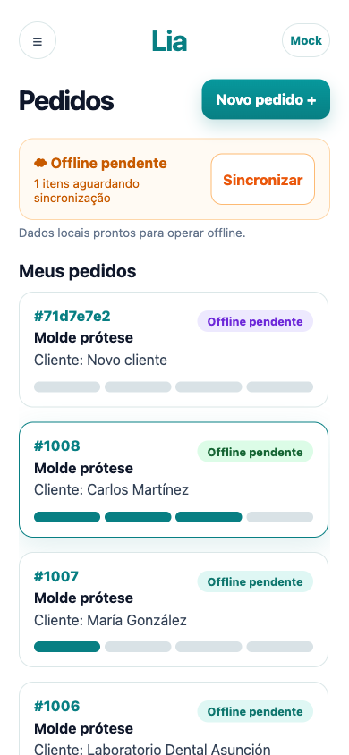
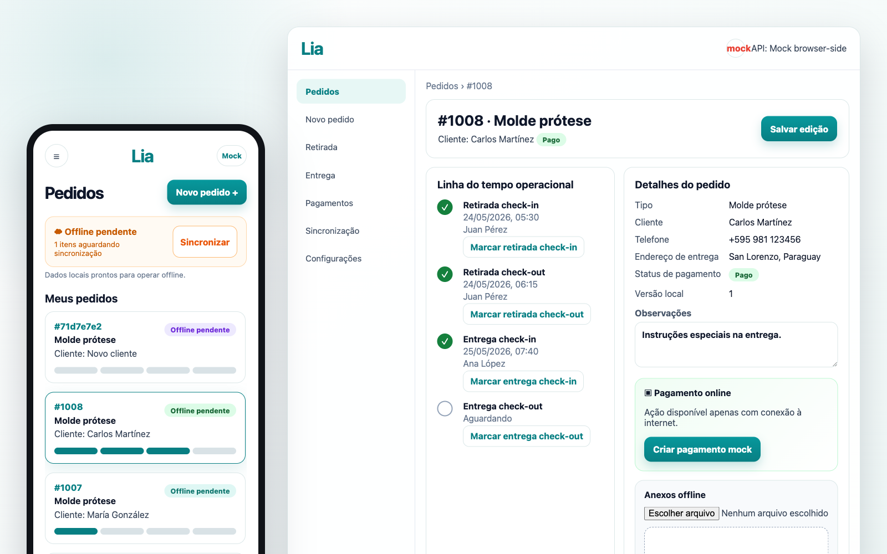
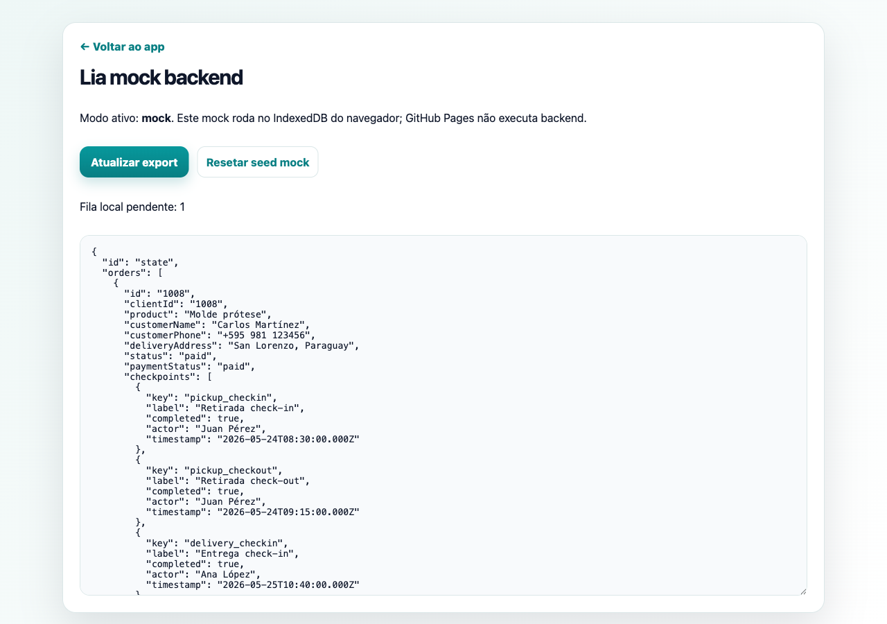

# Lia

[](https://github.com/Malnati/lia/actions/workflows/ci.yml)
[](https://github.com/Malnati/lia/actions/workflows/pages.yml)

**Lia** é um PWA offline-first para pedidos, retirada, entrega, anexos e pagamento mock de moldes para prótese dentária.

- Demo pública: <https://malnati.github.io/lia/>
- Mock backend browser-side: <https://malnati.github.io/lia/mock/>
- Repositório: <https://github.com/Malnati/lia>
- Frontend publicado no GitHub Pages: `apps/web`
- Backend NestJS preparado para local/VPS: `apps/api`
- Requisitos versionados: [`REQ.md`](REQ.md)

## Stack

- **Frontend:** React, Vite, TypeScript, PWA/service worker, Dexie/IndexedDB
- **Backend:** NestJS, TypeScript, MongoDB, Mongoose, GridFS
- **Infra local:** Podman Compose com MongoDB
- **Deploy frontend:** GitHub Actions + GitHub Pages
- **Package manager:** pnpm

## Features do MVP

- Cadastro e acompanhamento de pedidos de `Molde prótese`.
- Fluxo operacional com retirada check-in/check-out e entrega check-in/check-out.
- Fila de sincronização offline persistida no IndexedDB.
- Mock backend estático/browser-side para GitHub Pages e desenvolvimento frontend sem API real.
- Edição local de pedidos, anexos de foto compactada e assinatura do cliente via canvas.
- Pagamento online em modo abstração/mock; integração real Pagopar/Bancard fica para fase posterior.
- API NestJS com healthcheck, pedidos, checkpoints, anexos GridFS e payment-intents mock.

## Prints das telas

### App mobile PWA



### Painel desktop/admin



### Mock backend no GitHub Pages



## Arquitetura

```text
lia/
├── apps/
│   ├── web/      # React PWA publicado em https://malnati.github.io/lia/
│   └── api/      # NestJS API para VPS ou ambiente local
├── compose.yaml  # MongoDB local via Podman
└── .github/workflows/
    ├── ci.yml
    └── pages.yml
```

O GitHub Pages publica apenas o frontend estático. Como Pages não executa backend, o modo padrão do build público é `VITE_API_MODE=mock`, que usa IndexedDB no navegador como mock backend. Para usar a API real, gere o build com `VITE_API_MODE=api` e `VITE_API_URL` apontando para o NestJS.

## Setup local

```bash
pnpm install
cp .env.example .env
cp apps/api/.env.example apps/api/.env
```

Antes de subir containers, confirme o runtime Podman:

```bash
podman info
podman compose up -d mongo
```

Rodar tudo em modo desenvolvimento:

```bash
pnpm dev
```

Rodar separadamente:

```bash
pnpm dev:web
pnpm dev:api
```

URLs locais padrão:

- Frontend: <http://localhost:5173/lia/>
- Mock admin local: <http://localhost:5173/lia/mock/>
- API: <http://localhost:3000/api>
- Healthcheck: <http://localhost:3000/api/health>

## Variáveis de ambiente

| Variável | Uso | Exemplo |
| --- | --- | --- |
| `PORT` | Porta da API NestJS | `3000` |
| `MONGODB_URI` | Conexão MongoDB | `mongodb://localhost:27017/lia` |
| `CORS_ORIGIN` | Origem permitida para o frontend local | `http://localhost:5173` |
| `VITE_API_MODE` | Adapter do frontend: `mock` ou `api` | `mock` |
| `VITE_API_URL` | URL pública/local da API quando `VITE_API_MODE=api` | `http://localhost:3000/api` |
| `GOOGLE_CLIENT_ID` | Futuro Google OAuth/SSO | vazio no scaffold |
| `PAYMENT_GATEWAY_PROVIDER` | Futuro gateway no Paraguai | `mock`/`pagopar` |
| `PAYMENT_GATEWAY_PUBLIC_KEY` | Chave pública futura do gateway | vazio no scaffold |

## Scripts

```bash
pnpm lint      # typecheck dos apps
pnpm test      # testes unitários
pnpm build     # build API + frontend
pnpm build:web # build apenas do frontend para Pages
pnpm preview:web
```

## API NestJS

Prefixo global: `/api`.

Endpoints principais:

- `GET /api/health`
- `GET /api/orders`
- `POST /api/orders`
- `PATCH /api/orders/:id`
- `PATCH /api/orders/:id/status`
- `PATCH /api/orders/:id/checkpoints/:checkpointKey`
- `POST /api/orders/:id/attachments`
- `GET /api/orders/:id/attachments`
- `GET /api/orders/:id/attachments/:attachmentId/file`
- `POST /api/orders/:id/payment-intents`

Anexos aceitos: `image/webp`, `image/jpeg`, `image/png`, até 5MB. A API salva arquivos no Mongo GridFS (`orderAttachments`) com metadata do pedido.

## Mock browser-side

O mock não usa MSW em produção para não conflitar com o service worker PWA. Ele é um adapter JavaScript interno que persiste dados em IndexedDB:

- `orders`
- `syncQueue`
- `attachments`
- `mockBackend`

A subpágina `/lia/mock/` mostra modo ativo, export JSON, reset de seed e fila local pendente.

## Deploy no GitHub Pages

O workflow `.github/workflows/pages.yml` executa em push para `main` e publica `apps/web/dist` com:

```env
VITE_API_MODE=mock
```

Configuração importante do Vite:

```ts
base: '/lia/'
```

URL esperada do Pages:

<https://malnati.github.io/lia/>

## Status do Pages

- Fonte: GitHub Actions workflow.
- Conteúdo publicado: somente frontend React PWA.
- Backend: fora do Pages; usar VPS ou ambiente local para API real.

## Design

O conceito visual aprovado está versionado em [`docs/design/lia-concept.png`](docs/design/lia-concept.png).
