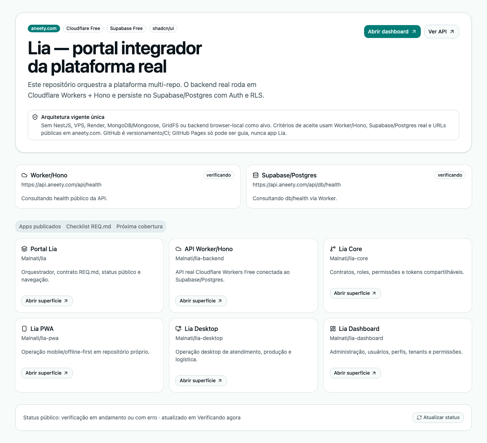

# Lia

[](https://github.com/Malnati/lia/actions/workflows/ci.yml)

**Lia** é o portal integrador da plataforma white-label para pedidos, produção, retirada, entrega, anexos, pagamentos e administração de próteses dentárias.

- Domínio oficial alvo: <https://aneety.com/>
- API real alvo: <https://api.aneety.com/>
- Core: <https://core.aneety.com/>
- PWA mobile: <https://pwa.aneety.com/>
- Desktop operacional: <https://desktop.aneety.com/>
- Dashboard administrativo: <https://dashboard.aneety.com/>
- Requisitos versionados: [`REQ.md`](REQ.md)

> Decisão vigente: Cloudflare Pages Free para frontends estáticos, Cloudflare Workers Free + Hono para API, Supabase/Postgres Free para base real. Não usar NestJS, VPS, Render, MongoDB ou mock browser-side como arquitetura alvo.

> GitHub é somente versionamento, PR e CI. GitHub Pages não é runtime de aplicativo Lia; se existir em algum repositório, deve servir apenas guias de usuário/documentação que apontam os apps reais para `*.aneety.com`.

## Arquitetura alvo

- `Malnati/lia`: portal orquestrador/integrador em `aneety.com` e fonte do contrato `REQ.md`.
- `Malnati/lia-backend`: API Worker + Hono em `api.aneety.com`.
- `Malnati/lia-core`: contratos ESM, roles, permissões e cliente comum em `core.aneety.com`.
- `Malnati/lia-pwa`: PWA mobile/offline-first em `pwa.aneety.com`.
- `Malnati/lia-desktop`: app operacional desktop em `desktop.aneety.com`.
- `Malnati/lia-dashboard`: administrativo com CRUD usuários/perfis em `dashboard.aneety.com`.

## Publicação por repositório

Cada projeto deve ser desenvolvido, testado, commitado, enviado e publicado no seu próprio diretório sob `/Users/mal/GitHub/malnati`:

- `lia` — orquestrador/portal em `https://aneety.com/`.
- `lia-backend` — Worker/Hono + migrations Supabase em `https://api.aneety.com/`.
- `lia-core` — ESM compartilhado em `https://core.aneety.com/`.
- `lia-dashboard` — administrativo em `https://dashboard.aneety.com/`.
- `lia-desktop` — operação desktop em `https://desktop.aneety.com/`.
- `lia-pwa` — operação mobile/PWA em `https://pwa.aneety.com/`.

O repositório `lia` não deve concentrar backend, core, dashboard, desktop ou PWA como implementação principal.

## Publicação, código e guias

- **Aplicação:** Cloudflare Pages Free em `aneety.com`, `core.aneety.com`, `pwa.aneety.com`, `desktop.aneety.com` e `dashboard.aneety.com`.
- **API:** Cloudflare Workers Free em `api.aneety.com`.
- **Código/PR/CI:** GitHub.
- **Guias de usuário:** GitHub Pages é permitido somente como documentação, nunca como app, smoke ou E2E.

## Stack

- **Portal:** React, Vite, TypeScript, Tailwind, shadcn/ui e Cloudflare Pages Free.
- **API:** Cloudflare Workers Free + Hono.
- **Banco:** Supabase/Postgres Free.
- **Auth:** Supabase Auth + RLS.
- **Segredos:** somente `.env` local ou Cloudflare secrets; nunca Git/frontend.

## Estado atual

Este repositório publica somente o portal orquestrador em `https://aneety.com/`. O portal exibe navegação para os apps publicados, status do Worker/Hono e `db/health` do Supabase/Postgres real. Implementações de PWA, desktop, dashboard, core e backend vivem nos seus repositórios próprios.

## Design system shadcn/ui

O portal React fica em `apps/web` e tem baseline shadcn/ui próprio:

- `apps/web/components.json` versionado com aliases `@/components`, `@/components/ui`, `@/lib`, `@/hooks`;
- componentes shadcn copiados em `apps/web/src/components/ui`;
- componentes usados no portal: `Alert`, `Badge`, `Button`, `Card`, `Separator` e `Tabs`;
- validação: `cd apps/web && pnpm dlx shadcn@latest info`.

## Print da tela

O print abaixo é regenerado quando houver mudança visual no portal.



## Guias de usuário

- [Guia mobile/PWA](docs/MOBILE.md)
- [Guia desktop/admin](docs/DESKTOP.md)
- [Marketplace operacional](docs/MARKETPLACE_OPERACIONAL.md)
- [Matriz de cobertura](docs/COVERAGE_MATRIX.md)

## Setup local

```bash
pnpm install
cp .env.example .env
pnpm dev
```

URLs locais padrão:

- Portal: <http://localhost:5173/>

## Variáveis de ambiente

| Variável | Uso | Segurança |
| --- | --- | --- |
| `CLOUDFLARE_ACCOUNT_ID` | Deploy local Cloudflare | local/secret |
| `CLOUDFLARE_API_TOKEN` ou `CLOUDFLARE_KEY` | Deploy local Cloudflare | secret |
| `SUPABASE_KEY` | PAT local para MCP/Codex | secret local, nunca frontend |
| `SUPABASE_PROJECT_URL` | Projeto Supabase; mapear para `SUPABASE_URL`/`VITE_SUPABASE_URL` | público |
| `SUPABASE_PUBLISHABLE_KEY` | Chave pública; mapear para `VITE_SUPABASE_PUBLISHABLE_KEY` ou compat `VITE_SUPABASE_ANON_KEY` | público |
| `SUPABASE_DIRECT_CONNECTION_STRING` | Diagnóstico/migrations controladas Postgres | secret local |
| `SUPABASE_SERVICE_ROLE_KEY` | Worker/admin only via Cloudflare secret quando disponível | secret backend |
| `VITE_API_URL` | API pública | `https://api.aneety.com` |
| `VITE_PUBLIC_BASE_PATH` | Base Vite | `/` para Cloudflare Pages |

## Scripts

```bash
pnpm lint               # typecheck do portal
pnpm test               # testes unitários
pnpm build              # build local padrão
pnpm build:cloudflare   # build para Cloudflare Pages em aneety.com
pnpm deploy:cloudflare  # deploy local para Cloudflare Pages Free
pnpm test:e2e           # Playwright contra URL publicada em PLAYWRIGHT_BASE_URL ou aneety.com
pnpm test:runtime-contract # valida que GitHub Pages não é runtime de app
```

## Deploy Cloudflare Pages Free

Usar credenciais locais de `/Users/mal/GitHub/malnati/lia/.env` sem imprimir valores e sem executar/source o arquivo inteiro:

```bash
export CLOUDFLARE_API_TOKEN="$(node -e "const fs=require('fs'); const rows=fs.readFileSync('.env','utf8').split(/\r?\n/); const env={}; for (const row of rows) { if (!/^[A-Za-z_][A-Za-z0-9_]*=/.test(row)) continue; const i=row.indexOf('='); env[row.slice(0,i)]=row.slice(i+1).replace(/^['\"]|['\"]$/g,''); } process.stdout.write(env.CLOUDFLARE_API_TOKEN || env.CLOUDFLARE_KEY || '');")"
test -n "$CLOUDFLARE_API_TOKEN"
pnpm deploy:cloudflare
```

Projeto Cloudflare Pages esperado: `lia`.
Domínio esperado: `https://aneety.com/`.

## Segurança

- `.env` é ignorado pelo Git.
- `SUPABASE_SERVICE_ROLE_KEY`, `SUPABASE_KEY` e `SUPABASE_DIRECT_CONNECTION_STRING` nunca devem entrar em bundle frontend.
- Se secrets/rotas reais faltarem, bloquear deploy real e implementar apenas scaffolds, docs, tipos e testes.
- E2E e validações de aceite usam apenas URLs públicas `aneety.com` e API real Worker/Hono.

## E2E publicado

```bash
PLAYWRIGHT_BASE_URL=https://aneety.com/ pnpm test:e2e
```

Por padrão, o smoke público valida portal, Worker/Hono, `db/health` e superfícies publicadas. Para a cobertura real cross-app, habilitar `LIA_E2E_ENABLED=1` com secrets de CI/local:

- `VITE_SUPABASE_URL`
- `VITE_SUPABASE_PUBLISHABLE_KEY`
- `LIA_E2E_ADMIN_EMAIL`
- `LIA_E2E_ADMIN_PASSWORD`
- `LIA_E2E_API_URL=https://api.aneety.com`
- `LIA_E2E_DESKTOP_URL=https://desktop.aneety.com`
- `LIA_E2E_PWA_URL=https://pwa.aneety.com`
- `LIA_E2E_DASHBOARD_URL=https://dashboard.aneety.com`

A cobertura cross-app cria pedido via API real, valida portal, opera checkpoint/anexo no desktop publicado, verifica login/superfície do PWA e CRUD base do dashboard, e confirma o estado final na API/Postgres.

E2E nunca deve usar localhost como alvo final.
