# Processos — Aneety Platform

Este arquivo descreve **como executar** a transição e os incrementos. Regras arquiteturais permanentes ficam em `01-arquitetura.md`; requisitos, requisitos não funcionais e critérios de aceite ficam em `02-requisitos.md`.

## Fluxos operacionais

Os SVGs abaixo são artefatos renderizados dos fluxos Mermaid mantidos em `assets/diagrams/`.

### Pedidos customizados

Registra a criação e o acompanhamento do pedido customizado, mantendo responsáveis, status, pendências e rastreabilidade até a conclusão.

Links: [Fonte Mermaid](assets/diagrams/fluxo-pedidos-customizados.mmd) / [JPEG](assets/diagrams/fluxo-pedidos-customizados.jpg)

  

### Produção ou execução

Mostra como a demanda sai do pedido aprovado, passa por aceite ou rejeição do responsável e registra execução, notas, checklist e evidências.

Links: [Fonte Mermaid](assets/diagrams/fluxo-producao-execucao.mmd) / [JPEG](assets/diagrams/fluxo-producao-execucao.jpg)

  

### Garantia de qualidade

Controla checkpoints sensíveis, exigindo evidência e aprovação antes de liberar a próxima etapa do pedido.

Links: [Fonte Mermaid](assets/diagrams/fluxo-garantia-qualidade.mmd) / [JPEG](assets/diagrams/fluxo-garantia-qualidade.jpg)

  

### Retirada, entrega e mapas

Organiza coleta e entrega com aceite do entregador, check-in, localização, mapa, check-out e atualização da rastreabilidade.

Links: [Fonte Mermaid](assets/diagrams/fluxo-retirada-entrega-mapas.mmd) / [JPEG](assets/diagrams/fluxo-retirada-entrega-mapas.jpg)

  

### Anexos e evidências

Descreve captura, validação, armazenamento de bytes, metadados e disponibilização das evidências conforme permissão.

Links: [Fonte Mermaid](assets/diagrams/fluxo-anexos-evidencias.mmd) / [JPEG](assets/diagrams/fluxo-anexos-evidencias.jpg)

  

### Pagamentos

Conduz intenção, consulta e conciliação de pagamento, preservando o pedido mesmo quando o provedor estiver indisponível.

Links: [Fonte Mermaid](assets/diagrams/fluxo-pagamentos.mmd) / [JPEG](assets/diagrams/fluxo-pagamentos.jpg)

  

### Marketplace operacional

Permite listar, filtrar, favoritar e acionar atores operacionais, registrando aceite ou rejeição da demanda.

Links: [Fonte Mermaid](assets/diagrams/fluxo-marketplace-operacional.mmd) / [JPEG](assets/diagrams/fluxo-marketplace-operacional.jpg)

  

### White-label por tenant

Define marca, logo, cores, textos e fluxos ativos para publicar a experiência de cada tenant sem acoplar o produto a uma única marca.

Links: [Fonte Mermaid](assets/diagrams/fluxo-white-label-tenant.mmd) / [JPEG](assets/diagrams/fluxo-white-label-tenant.jpg)

  

### Carga inicial de demonstração e testes

Reclassifica evidências úteis do MVP Lia como demo, seed ou massa de teste, sem limitar o produto Aneety à vertical odontológica.

Links: [Fonte Mermaid](assets/diagrams/fluxo-carga-demo-testes.mmd) / [JPEG](assets/diagrams/fluxo-carga-demo-testes.jpg)

  

### Administração

Gerencia usuários, identidades, tenants, perfis, permissões, status de acesso e métricas operacionais.

Links: [Fonte Mermaid](assets/diagrams/fluxo-administracao.mmd) / [JPEG](assets/diagrams/fluxo-administracao.jpg)

  

### Integração opcional Gmail

Mostra o modo opcional de e-mail: operar sem Gmail quando desligado ou acionar o adapter com degradação controlada quando habilitado.

Links: [Fonte Mermaid](assets/diagrams/fluxo-integracao-gmail.mmd) / [JPEG](assets/diagrams/fluxo-integracao-gmail.jpg)

  

### Integração opcional Google SSO

Mostra o vínculo externo opcional de identidade, preservando autenticação, sessão, tenant, perfil e permissões no modelo Aneety.

Links: [Fonte Mermaid](assets/diagrams/fluxo-integracao-google-sso.mmd) / [JPEG](assets/diagrams/fluxo-integracao-google-sso.jpg)

  

## Desenvolvimento

1. Registrar requisito, interface e critério de aceite em `02-requisitos.md` antes de implementar.
2. Classificar responsabilidade, módulo, repo e submódulo conforme `01-arquitetura.md`.
3. Registrar documentação e assets nos destinos canônicos definidos em `01-arquitetura.md` quando o incremento precisar deles.
4. Para responsabilidades com dados e UI, executar na ordem: DB -> BFF/worker -> gateway/contrato público -> microfrontend.
5. Validar contrato, permissões, erros, estados de UI e copy conforme `02-requisitos.md`.
6. Testar por camada: unitários em contratos/pacotes, integração nos BFFs e E2E público por fluxo crítico quando houver URL publicada.
7. Fechar incremento somente com evidência objetiva de build, smoke, publicação e testes do escopo tocado.

## Operação

1. Preparar massa controlada e idempotente para smoke/E2E quando o incremento exigir.
2. Verificar secrets antes de deploy real sem imprimir valores.
3. Confirmar backup/export antes de usar dados reais relevantes.
4. Rodar smoke público dos componentes afetados.
5. Conferir monitoramento recorrente contra o contrato Aneety vigente.
6. Registrar bloqueios com causa objetiva e próxima ação.
7. Validar modo desligado de integrações opcionais antes de ativação por tenant.

## Migração do MVP para Aneety Platform

1. Extrair requisitos úteis do MVP atual e docs existentes.
2. Reescrever requisitos no vocabulário white-label genérico, mantendo Lia como tenant inicial.
3. Reclassificar pedidos, moldes, próteses, retirada, entrega e evidências odontológicas como demo, seeds e massas de teste.
4. Ignorar decisões temporárias que pertenciam ao protótipo.
5. Definir responsabilidades genéricas antes de criar diretórios concretos.
6. Criar repo, clone local, submódulo, documentação e assets somente quando os contratos de `01-arquitetura.md` e `02-requisitos.md` estiverem atendidos.
7. Implementar primeiro contratos compartilhados, DB e BFF da responsabilidade.
8. Integrar microfrontend Single SPA somente depois de BFF e schema verificáveis.
9. Migrar evidências úteis: screenshots, E2E, nomes de status, permissões, fluxos, mapas, rastreabilidade e componentes shadcn.
10. Copiar código legado somente depois de revisar contrato, segurança, isolamento por tenant e copy de usuário final.

## Gate de conclusão por incremento

Executar o gate como checklist operacional, apontando a evidência para `01-arquitetura.md` e `02-requisitos.md`:

1. Requisito rastreado e critério de aceite definido.
2. Responsabilidade, módulo, repo/submódulo, documentação e assets conferidos contra a arquitetura.
3. Migration, RLS/policies, permissões e isolamento verificados quando houver dados.
4. BFF/worker com caso feliz e erros esperados verificados quando houver API.
5. Mapas e rastreabilidade testados quando o fluxo exigir localização ou status em tempo real.
6. Microfrontend validado com estados de carregamento, vazio, erro e sucesso quando houver UI.
7. Smoke ou E2E executado quando houver URL publicada.
8. Diff, logs e bundle revisados para ausência de segredos.

## Gate de serviços externos

Antes de aceitar qualquer dependência externa, executar:

1. Classificar função semântica em `01-arquitetura.md`.
2. Confirmar requisitos de custo, dados, segredos, contrato local, degradação e plano de saída em `02-requisitos.md`.
3. Registrar owner, adapter e testes do modo feliz e do modo de falha.
4. Se houver violação de requisito ou limite arquitetural, bloquear o incremento e redesenhar.

## Gate de integração opcional do MVP

Antes de ativar Gmail ou Google SSO:

1. Conferir responsabilidade e adapter na arquitetura.
2. Conferir requisitos técnicos e não funcionais da integração.
3. Validar modo desligado por smoke ou E2E.
4. Validar degradação com fornecedor indisponível, recusando acesso ou excedendo limite.
5. Conferir que dados de domínio, sessão final, permissões e auditoria permanecem no modelo Aneety.
6. Revisar evidências para ausência de segredos privilegiados.
